# CMAC CrediSol - Análisis de Créditos, Depósitos y Simulación Financiera en Excel/VBA

Me encargo de la construcción y análisis de los KPIs financieros de una caja municipal ficticia con la razón social "CMAC CrediSol", además del diseño de herramientas de simulación financiera (Buscar Objetivo, Análisis de Hipótesis, Administrador de Escenarios). Este es mi segundo proyecto de portafolio para mis prácticas pre-profesionales en Análisis de Datos.

## Objetivo

Simular el trabajo de un analista dentro de una entidad microfinanciera a partir de datos crudos de clientes, créditos y depósitos, transformándolos en un modelo relacional, un set de KPIs financieros, herramientas de simulación de decisiones (Buscar Objetivo, Tablas de Datos, Escenarios), un dashboard interactivo y automatización con formularios VBA. A diferencia de mi proyecto anterior, este simula un **negocio en marcha** en vez de un dataset con años cerrados.

## ¿Qué hace el proyecto?

1. **Modela un sistema relacional completo:** Clientes, Créditos, Depósitos, Agencias, Tipos de Crédito y Tipos de Depósito, todos conectados mediante `BUSCARX`.
2. **Simula un negocio en marcha:** Las fechas de vigencia, morosidad y vencimiento dependen de `HOY()`, no de un rango cerrado — el archivo se recalcula solo con el paso del tiempo.
3. **Simulación de mora controlada:** 10% de probabilidad de morosidad por crédito, validada para que ningún crédito pueda entrar en mora antes de que venza su primera cuota real.
4. **Cálculo de KPIs financieros:** Cartera, tasa de morosidad, ratio de liquidez, ratio de cobertura de depósitos, solvencia, margen financiero, ROA y ROE, usando `SUMAR.SI.CONJUNTO`, `SUMAPRODUCTO`, `INDICE` + `COINCIDIR` y funciones financieras (`PAGO`, `VA`).
5. **Simulador de crédito con Análisis de Hipótesis:** Una Tabla de Datos de dos variables (TEA × Plazo) que calcula la cuota mensual para cualquier combinación sin escribir una fórmula por celda.
6. **Buscar Objetivo aplicado a un caso real:** Determina cuántos créditos nuevos se necesitan colocar para alcanzar una meta de utilidad definida.
7. **Administrador de Escenarios:** 3 escenarios de morosidad (optimista/base/pesimista) con resumen comparativo automático de su impacto en la utilidad.
8. **Automatización con 3 formularios VBA:** Registro de nuevos Clientes, Créditos y Depósitos con generación automática de ID, validación de existencia de cliente contra la base y cálculo automático de fechas (registro, desembolso, vencimiento) para que cualquier trabajador los use sin conocimiento técnico de Excel.

## Funciones y herramientas aplicadas

| Módulo | Técnicas usadas |
|---|---|
| Modelo relacional | `BUSCARX` entre 6 tablas conectadas por ID |
| Funciones financieras | `PAGO` (cuota mensual), `VA` (saldo pendiente / valor presente de flujos futuros) |
| Fechas dinámicas | `HOY()`, `SIFECHA` (DATEDIF), `FECHA.MES` (EDATE) |
| Simulación de riesgo | Morosidad simulada con `ALEATORIO.ENTRE`, acotada al tiempo real transcurrido |
| Análisis agregado | `SUMAR.SI.CONJUNTO`, `CONTAR.SI.CONJUNTO`, `SUMAPRODUCTO`, `INDICE` + `COINCIDIR` |
| Análisis de Hipótesis | Tabla de Datos de 2 variables (TEA × Plazo → Cuota Mensual) |
| Buscar Objetivo | Créditos nuevos necesarios para alcanzar una meta de utilidad |
| Administrador de Escenarios | 3 escenarios de morosidad con resumen comparativo automático |
| Dashboard | Tarjetas de KPI enlazadas, 7 gráficos dinámicos, tablas dinámicas, segmentadores |
| Automatización (VBA) | 3 UserForm (Clientes, Créditos, Depósitos), ID autogenerado, validación cruzada con `CONTAR.SI` y `BUSCARX` en código |

## Hojas del libro Excel

- **Dashboards** — Vista principal con KPIs, gráficos y segmentadores
- **KPIs** — Cartera, riesgo, liquidez, solvencia y rentabilidad
- **Clientes / Creditos / Depositos** — Tablas principales del modelo
- **Agencias / TiposCredito / TiposDeposito** — Catálogos base
- **TD Creditos / TD Depositos** — Tablas dinámicas de soporte
- **Simulador** — Tabla de Datos (TEA × Plazo)
- **Meta y Escenarios** — Buscar Objetivo y Administrador de Escenarios
- **Resumen del escenario** — Comparación de los 3 escenarios de morosidad

## Imágenes de las hojas

### Dashboard

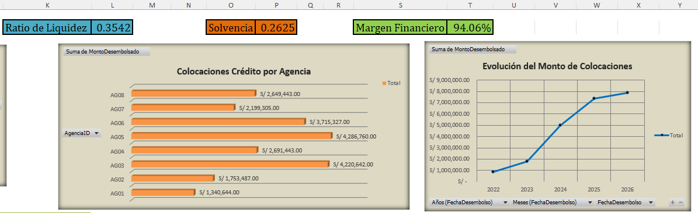
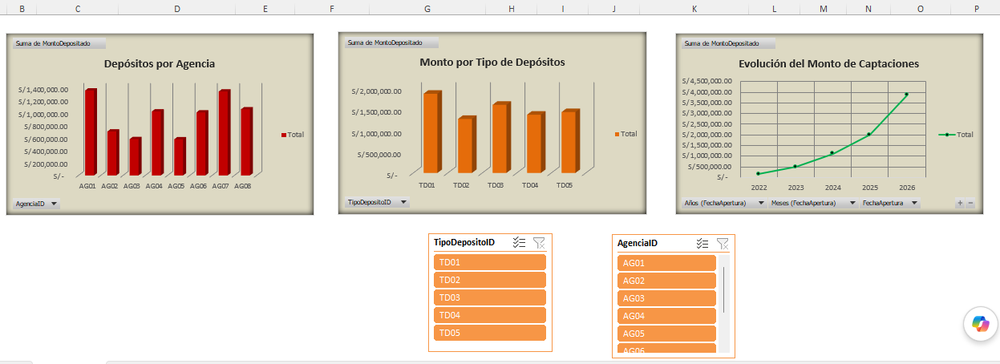

### Hoja de KPIs
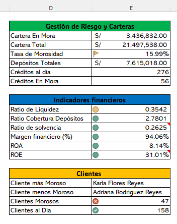

### Simulador — Análisis de Hipótesis (TEA × Plazo)
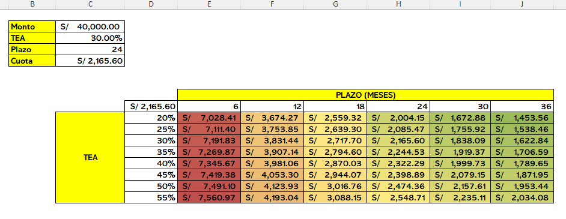

### Meta y Escenarios — Buscar Objetivo
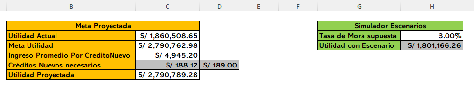

### Resumen del Escenario — Administrador de Escenarios
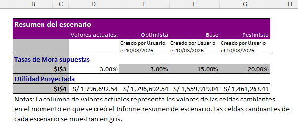

### Formulario VBA - Registro de Clientes Nuevos
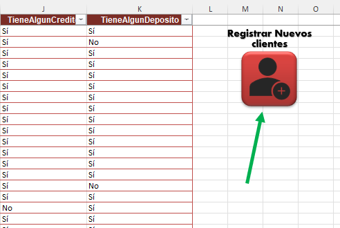
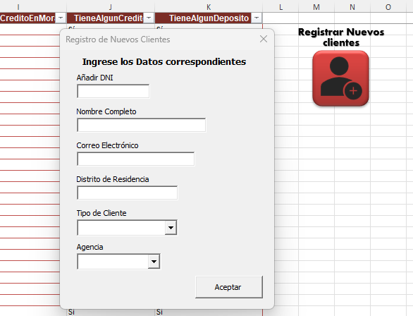

### Formulario VBA — Registro de Créditos
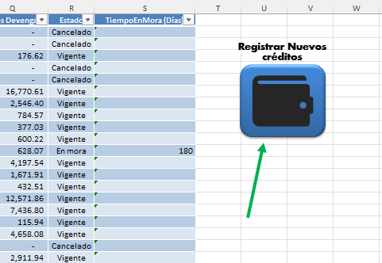
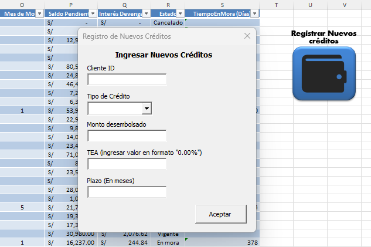

### Formulario VBA — Registro de Depósitos
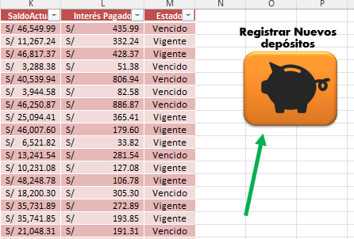
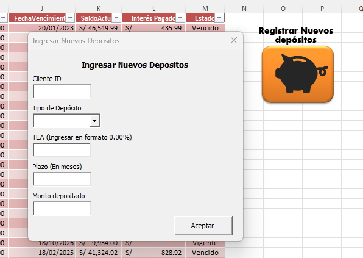

## Decisiones de diseño

* **Negocio en marcha sobre años cerrados:** Todas las fechas dependen de `HOY()` en vez de un rango fijo, para que el archivo se comporte como una entidad financiera real que sigue operando.
* **`BUSCARX` sobre `BUSCARV`:** La razón por la que usé `BUSCARX` es la misma razón que en mi proyecto anterior — no depende de que la columna buscada esté a la izquierda de la columna resultado.
* **Patrimonio asumido (S/ 6,000,000):** el dataset no incluye información contable de capital propio, así que declaré un supuesto explícito para poder calcular el Ratio de Solvencia y el ROE.
* **Margen Financiero como indicador bruto:** No incluye gastos operativos (planilla, alquiler de agencias, etc.), que no forman parte del dataset — por eso el margen resulta alto (~94%) y debe leerse como margen bruto, no como utilidad neta real.
* **Escenario de mora como aproximación lineal:** El Administrador de Escenarios trata el impacto de la morosidad como una reducción proporcional del ingreso financiero, no como un modelo actuarial completo de pérdida esperada.
* **Formularios VBA con ID autogenerado:** Se optó por calcular los siguientes IDs a partir del último registro existente (`CL####`, `CR#####`, `D####`) en vez de que el usuario lo escriba, para evitar IDs duplicados o mal formateados al usar el formulario.

## Limitaciones

- El dataset es simulado; los patrones de mora, colocación y captación no reflejan el comportamiento real de una caja municipal peruana.
- El Ratio de Solvencia depende de un supuesto de Patrimonio declarado explícitamente en Decisiones de diseño.
- Los formularios VBA no completan por sí mismos todas las columnas calculadas del modelo (dependen de que las tablas de Excel autocompleten fórmulas al expandirse); por lo que es recomendable verificar cada registro nuevo antes de un uso productivo real.

## Autor

**Luis Esteban Davila Naveda** Estudiante de Economía - UNALM

- Correo electrónico: estebandavnav10@gmail.com
- LinkedIn: [linkedin.com/in/luis-esteban-davila-naveda](https://www.linkedin.com/in/luis-esteban-davila-naveda)
